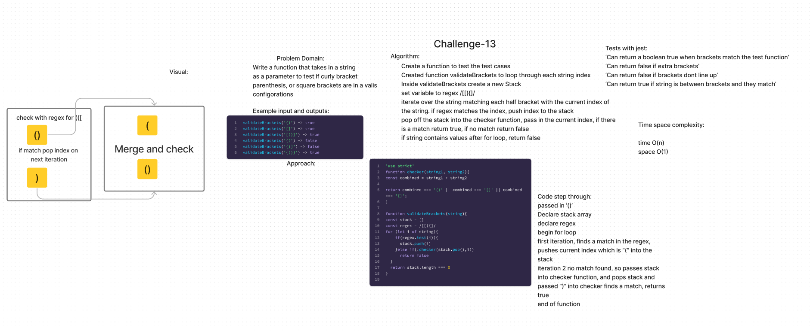

# Singly Linked List

Code Challenge 13

[Link to code](https://github.com/tm-LBenson/data-structures-and-algorithms/tree/main/javascript-401/challenge-13)

## Challenge

Write a function that takes in a string
as a parameter to test if curly bracket
parenthesis, or square brackets are in a valid
configurations

## Approach & Efficiency

## API

### Feature 1:

function called validateBrackets
Arguments: string
Return: boolean
representing whether or not the brackets in the string are balanced
