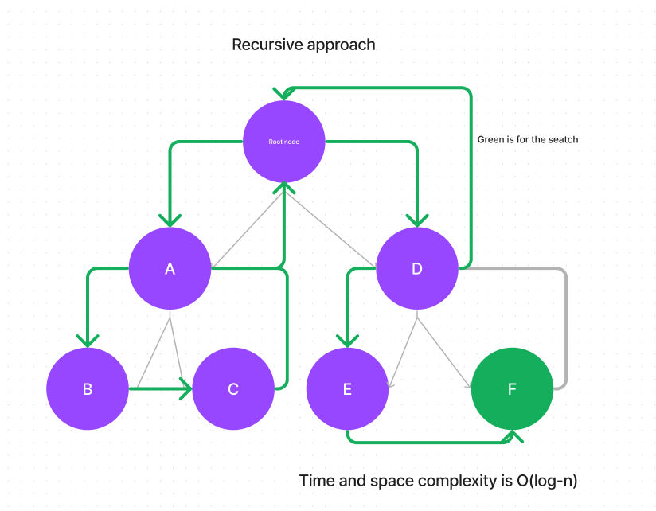

# Binary-Search-Tree

Code Challenge 15

[Link to code](https://github.com/tm-LBenson/data-structures-and-algorithms/tree/main/javascript-401/challenge-15)

## Challenge

Build a binary tree and a binary search tree with a recursive approach.

## Approach & Efficiency

Build a binary tree and a binary search tree with a recursive approach.

## API

Can successfully instantiate an empty tree
Can successfully instantiate a tree with a single root node
For a Binary Search Tree, can successfully add a left child and right child properly to a node
Can successfully return a collection from a preorder traversal
Can successfully return a collection from an inorder traversal
Can successfully return a collection from a postorder traversal

### Feature 1:

Node class that has properties for the value stored in the node, the left child node, and the right child node.

`add`
Arguments: value
Return: nothing
Adds a new node with that value in the correct location in the binary search tree.
`contains`
Argument: value
Returns: boolean indicating whether or not the value is in the tree at least once.

`preOrder`
Arguments: none
Return: an array of values
`inOrder`
Arguments: none
Return: an array of values
`postOrder`
Arguments: none
Return: an array of values
