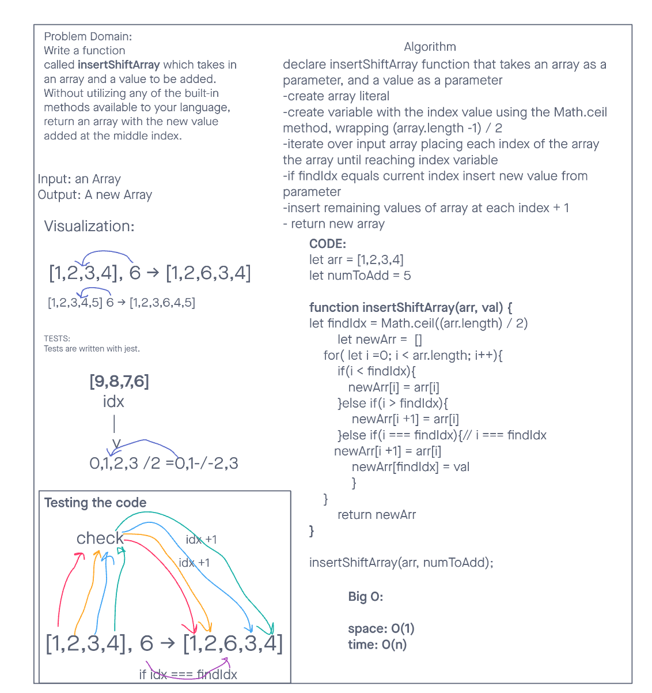

# Reverse an Array

Problem Domain:

Write a function called insertShiftArray which takes in an array and a value to be added. Without utilizing any of the built-in methods available to your language, return an array with the new value added at the middle index.

## Whiteboard Process

## Approach & Efficiency

I used an iterative approach to solve this problem. A for loop iterates over the original array, each value is assigned to a new array until it reaches the center index. A new value is added, then each index of the remaining values are added to the new array at index + 1.
As a new array is being returned, this will have a space complexity of O(1) and a time complexity of O(n).
