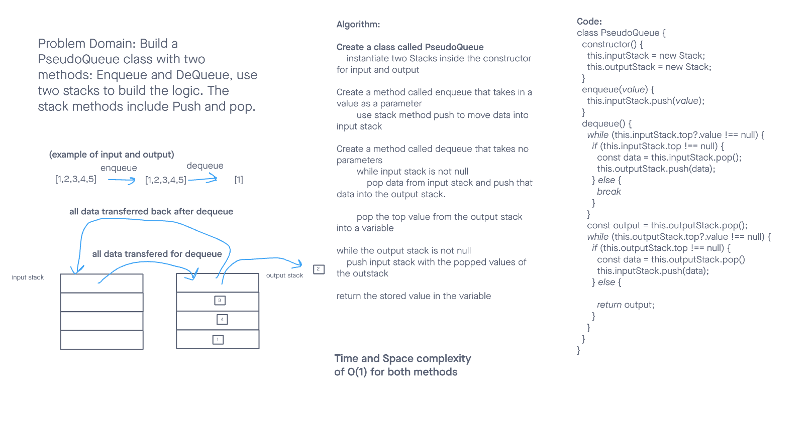

# Singly Linked List

Code Challenge 10 - 11

[Link to code](https://github.com/tm-LBenson/data-structures-and-algorithms/tree/main/javascript-401/challenge-10)

## Challenge

Lab 10:
Using a Linked List as the underlying data storage mechanism, implement both a Stack and a Queue

Lab 11:
Using a the Stack from previous code challenge, build a queue only using two instances of stacks, and the stack methods.

## Approach & Efficiency

## Challenge 10:

My approach for each data structure is to move the point at the entry point, and move the pointer at the output when applicable giving the methods and approaches both a space and time complexity of O(1)

I followed [the approach in this whiteboard](https://codefellows.github.io/common_curriculum/data_structures_and_algorithms/Code_401/class-10/resources/stacks_and_queues.html)

## Challenge 11:

My approach for dequeue is to move all the data into the output queue, grab the top value in a variable, then pass all the data back to the input queue. return the variable
My approach for enqueue is to use the push method on the input stack.

## API

### Feature 1:

#### Building a stack with a top property that creates an empty stack when instantiated.

#### The class should contain the following methods:

`push`
Arguments: value
adds a new node with that value to the top of the stack with an O(1) Time performance.

`pop`
Arguments: none
Returns: the value from node from the top of the stack
Removes the node from the top of the stack
Should raise exception when called on empty stack

`peek`
Arguments: none
Returns: Value of the node located at the top of the stack
Should raise exception when called on empty stack

`isEmpty`
Arguments: none
Returns: Boolean indicating whether or not the stack is empty.

### Feature 2:

### Building a queue with a top property that creates an empty stack when instantiated

### The class should contain the following methods:

`enqueue`
Arguments: value
adds a new node with that value to the back of the queue with an O(1) Time performance.

`dequeue`
Arguments: none
Returns: the value from node from the front of the queue
Removes the node from the front of the queue
Should raise exception when called on empty queue

`peek`
Arguments: none
Returns: Value of the node located at the front of the queue
Should raise exception when called on empty stack

`isEmpty`
Arguments: none
Returns: Boolean indicating whether or not the queue is empty

### Feature 3:

#### Build a PseudoClass using only two stack instances built in challenge-10

#### The class should contain the following methods:

`enqueue`
Arguments: value
adds a new node with that value to the back of the queue with an O(1) Time performance.

`dequeue`
Arguments: none
Returns: the value from node from the front of the queue
Removes the node from the front of the queue
Should raise exception when called on empty queue
