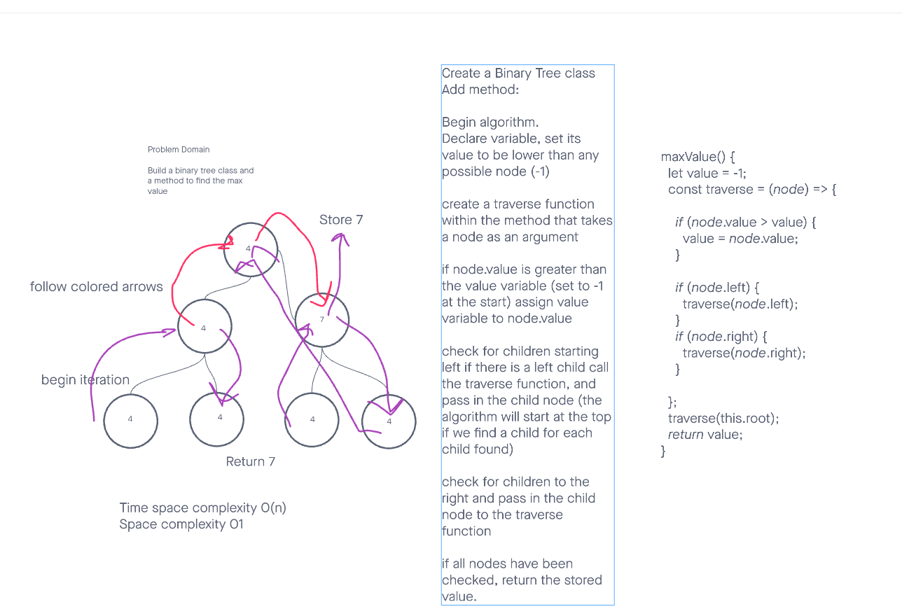

# Binary-Search-Tree

Code Challenge 15

[Link to code](https://github.com/tm-LBenson/data-structures-and-algorithms/tree/main/javascript/401/challenge-16)

## Challenge

Build a binary tree class and a method to find the max value

## Approach & Efficiency

Build a binary tree and a binary search tree with a recursive approach.

## API

-Can successfully instantiate an empty tree

Can successfully instantiate a tree with a single root node

Can successfully return the highest number in the tree by calling the `maxValue` method.

### Feature 1:

`maxValue()`
arguments: none
Returns: The highest integer within the tree.
