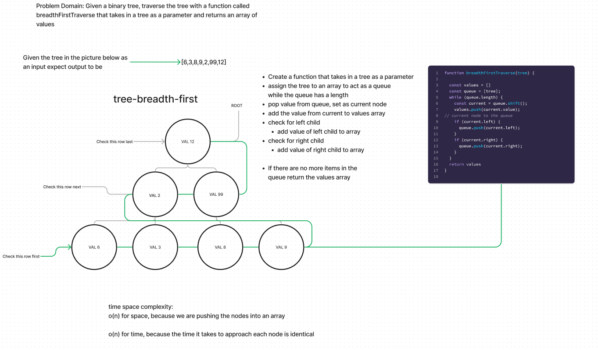

# Breadth-First

Code Challenge 17

[Link to code](https://github.com/tm-LBenson/data-structures-and-algorithms/tree/main/javascript/401/challenge-16)

## Challenge

Create a function to navigate a binary tree Breadth First

## Approach & Efficiency

Iterate over the tree using a Queue to add each node

## API

- Returns an array with all the values in the correct order for a breadth traversal

### Feature 1:

`breadthFirstTraverse(tree)`
arguments: tree
Returns:An array with all values in the order of breadthFrist
