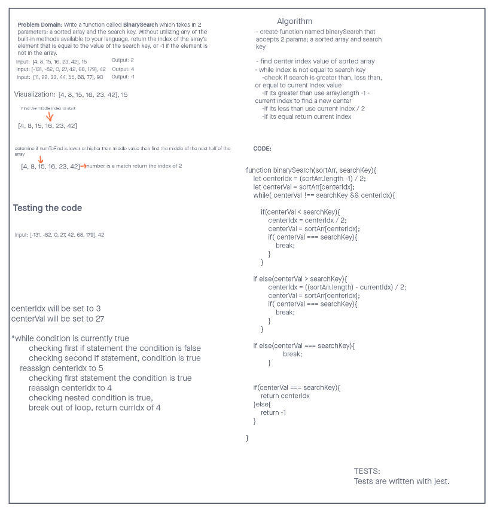

# Reverse an Array

Problem Domain:

Write a function called binarySearch which takes in 2 parameters: a sorted array and the search key. Without utilizing any of the built-in methods available to your language, return the index of the array’s element that is equal to the value of the search key, or -1 if the element is not in the array.

## Whiteboard Process

## Approach & Efficiency

I used a binary search approach to solve this problem. A while loop will keep the array splitting in half until it finds a matching value, when the value is matched, it will break the while loop and return the index. If no value is matched, it will break the while loop and return -1
This will have a space complexity of O(1) and a time complexity of O(n) because its a single while loop, and will only sequentially grow as new indexes are added.
