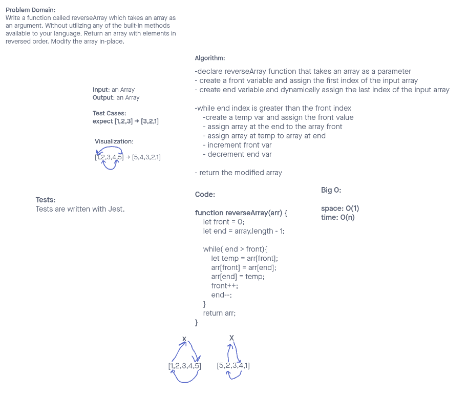

# Reverse an Array

Write a function called `reverseArray` which takes an array as an argument. Without utilizing any of the built-in methods available to your language, return an array with elements in reversed order.

## Whiteboard Process

## Approach & Efficiency

This assignment was a code along. Credit for this approach belongs to Ryan Gallaway. I agree with the approach as an iterative way to reverse an array. As the original array is being modified this will have a space complexity of O(1) and a time complexity of O(n).
